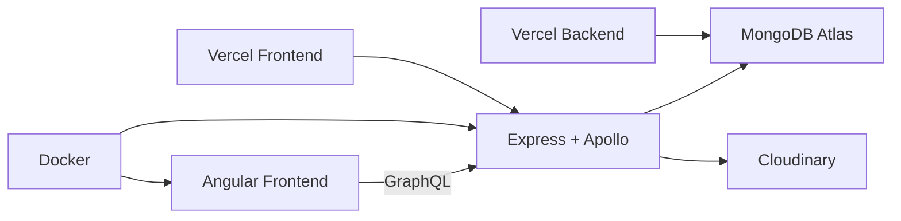
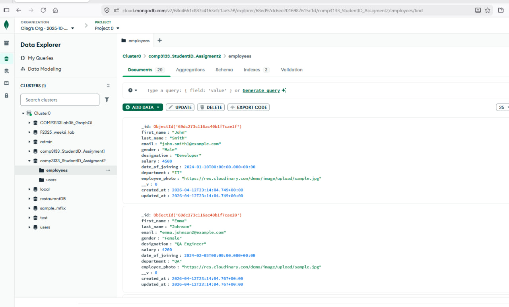
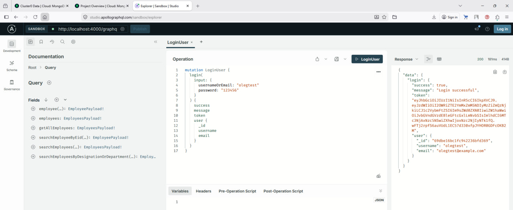
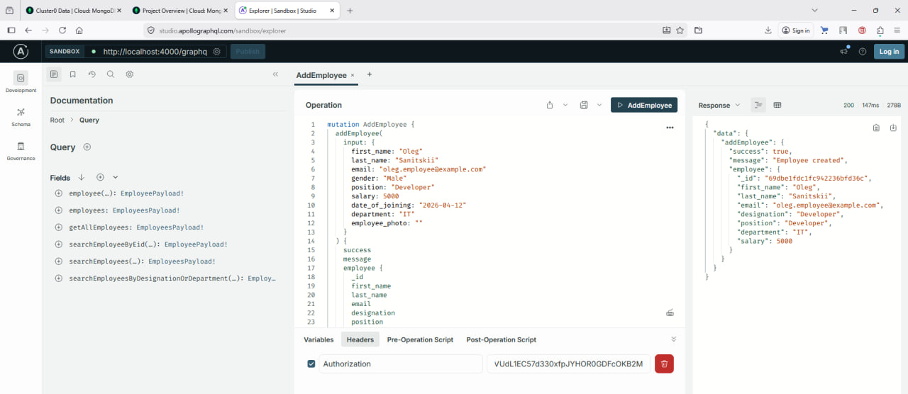
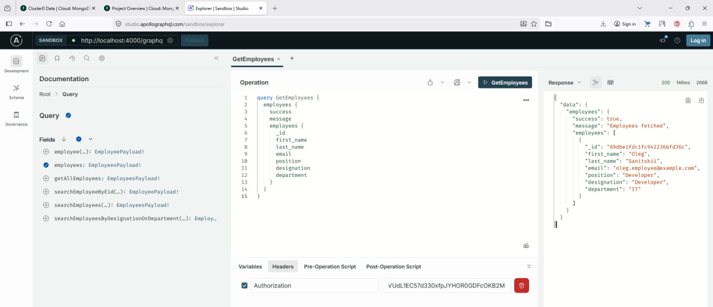

<h1 align="center">⚡Employee Management System</h1>

<p align="center">
  <b>COMP3133 - Full Stack Development</b><br>
  Oleg Sanitskii • 101466133
</p>

<p align="center">
  
  
  
  
  
  
  
</p>

---

## 🚀 Quick Access (Vercel)

| Service | Link |
|--------|------|
| 🌐 Frontend | https://101466133-comp3133-assignment2-ym36.vercel.app |
| ⚙️ Backend | https://101466133-comp3133-assignment2.vercel.app |
| 🔬 GraphQL | https://101466133-comp3133-assignment2.vercel.app/graphql |


---


## 🐳 Docker

```bash
docker-compose up --build
```

- Frontend → http://localhost:8080  
- Backend → http://localhost:4000  
- GraphQL → http://localhost:4000/graphql  

---

## 📖 Overview

A full-stack employee management system with authentication and CRUD operations.

### ✨ Key Features

- 🔐 JWT Authentication (Signup / Login)
- 👨‍💼 Employee CRUD
- 🔍 Advanced Search (position + department)
- ☁️ MongoDB Atlas integration
- 🐳 Docker support
- 🚀 Vercel deployment

---

## 🧭 Architecture



---

## 🧱 Project Structure

```text
Assignment2/
│
├── 101466133_comp3133_assignment2/
│   ├── backend/
│   ├── frontend/
│   └── docker-compose.yml
│
├── screenshots/
```


---

## 📦 Local Setup

### Backend

```bash
cd backend
npm install
npm run dev
```

### Frontend

```bash
cd frontend
npm install
ng serve
```

---

## 📊 GraphQL Examples

### 🔹 Login

```graphql
mutation {
  login(input: {
    usernameOrEmail: "olegtest"
    password: "123456"
  }) {
    success
    token
  }
}
```

### 🔹 Get Employees

```graphql
query {
  employees {
    employees {
      _id
      first_name
      last_name
      email
    }
  }
}
```

---

## 📸 Screenshots

<p align="center">
  <br>
  <b>MongoDB Data Explorer</b>
</p>

<p align="center">
  <br>
  <b>Login Mutation</b>
</p>

<p align="center">
  <br>
  <b>Add Employee</b>
</p>

<p align="center">
  <br>
  <b>Get Employees</b>
</p>

---

## 📌 Notes

✔ Full-stack Angular + GraphQL  
✔ Cloud deployment (Vercel)  
✔ Containerized environment (Docker)  
✔ Production-ready architecture  

---

<p align="center">
  🚀 Built for COMP3133 • Full Stack Development
</p>